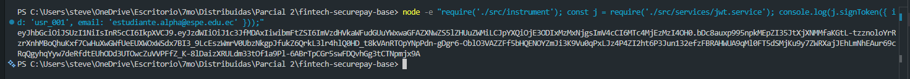
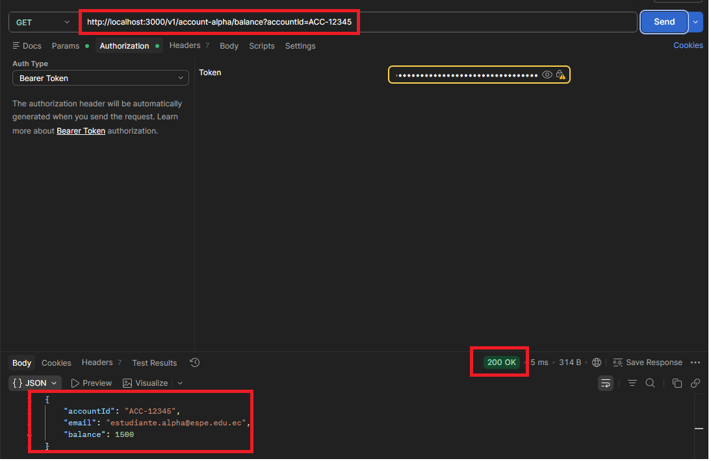
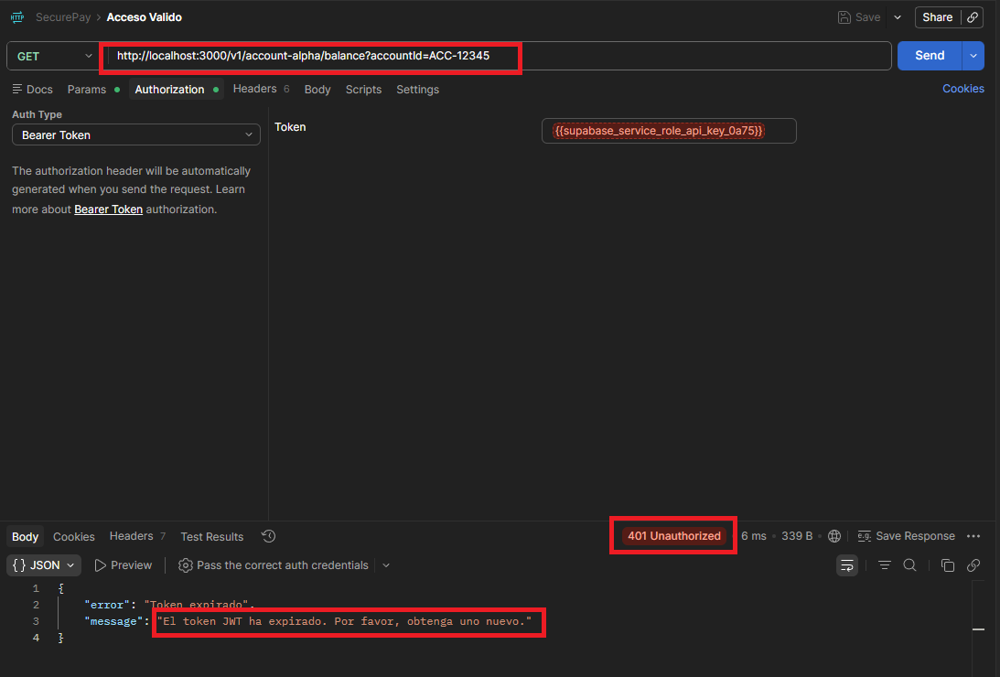
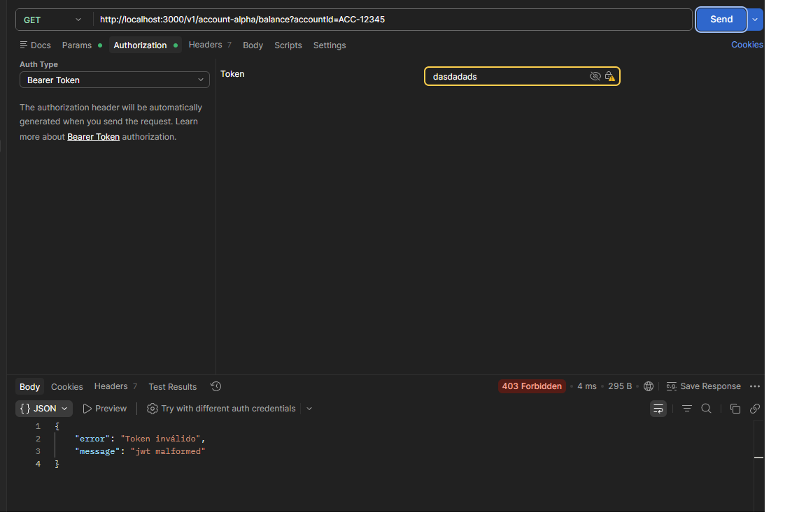
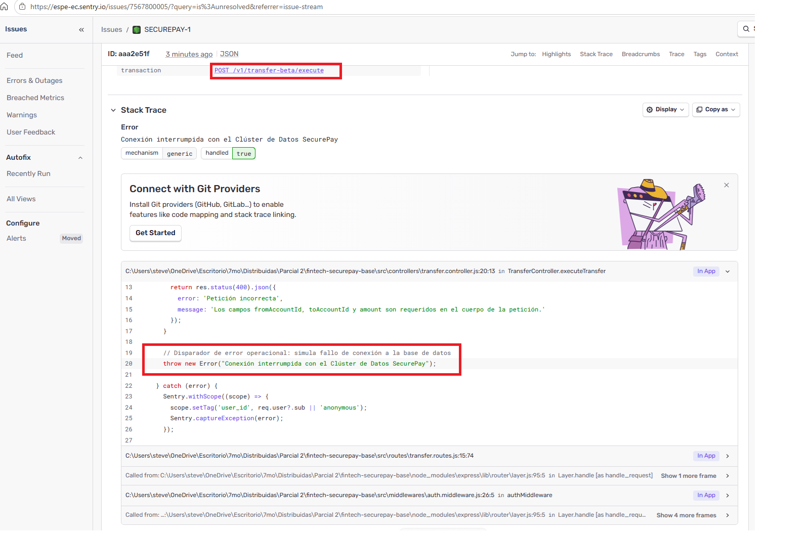
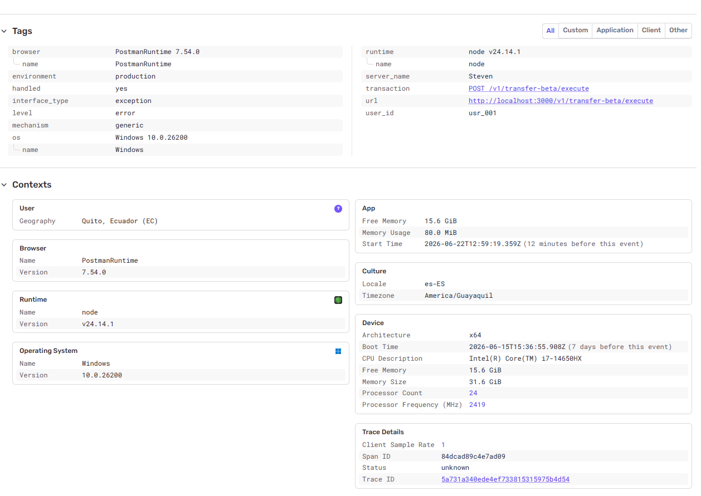
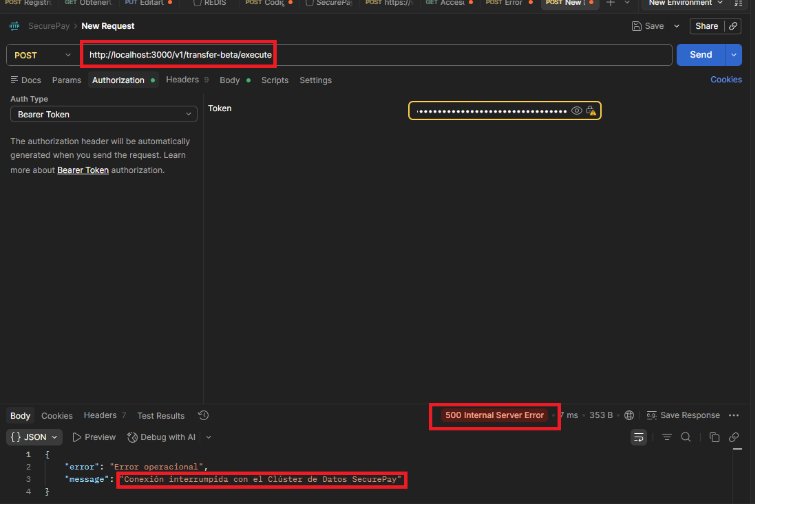

# Fintech SecurePay — Bitácora de Evaluación

**Estudiante:** Steven Molina  
**Materia:** Aplicaciones Distribuidas  
**Repositorio:** `fintech-securepay-base`

---

## Informe del Examen

El informe completo del examen parcial se encuentra en el siguiente documento:

[MolinaGustavo_ExamenParcial2.pdf](MolinaGustavo_ExamenParcial2.pdf)

---

## Configuración e Instalación

```bash
npm install
bash keypair.sh       # genera private.pem y public.pem
cp .env.example .env  # configurar SENTRY_DSN
npm run dev
```

---

## Fase 1 — Inyección de Control y Responsabilidad Única (SOLID)

### Rama: `feature/01-refactor-solid`

Se descompuso el monolito `transaction.monolith.service.js` aplicando **SRP** y **DIP**:

| Servicio | Responsabilidad única |
|---|---|
| `account.repository.js` | Gestión del estado en memoria (usuarios y transacciones) |
| `financial.validation.service.js` | Validación de cuentas y reglas financieras |
| `notification.service.js` | Envío de notificaciones por consola |
| `transaction.monolith.service.js` | Orquestador delgado (recibe los 3 servicios por constructor) |

Los controladores (`TransferController`, `AccountController`) reciben `TransactionService` por constructor, aplicando **Inversión de Dependencias (DIP)**.

---

## Fase 2 — Criptografía y Flujo Distribuidor (JWT RS256)

### Rama: `feature/02-auth-jwt`

Se implementó autenticación asimétrica **RS256** con claves PKCS#8:

- `signToken(user)` — firma con `private.pem`, claims `sub`, `name`, expiración **2 minutos**
- `verifyToken(token)` — verifica con `public.pem` de forma autónoma
- `auth.middleware.js` — intercepta el Bearer Token en ambos microservicios (Alpha y Beta)

### Generación del par de claves

```bash
bash keypair.sh
```

### Pruebas con Postman

#### Token generado (RS256 válido)

> Comando para generar token de prueba:
> ```bash
> node -e "require('./src/instrument'); const j = require('./src/services/jwt.service'); console.log(j.signToken({ id: 'usr_001', email: 'estudiante.alpha@espe.edu.ec' }));"
> ```

<!-- Reemplaza la ruta por tu captura real --> 


#### Acceso válido — GET /v1/account-alpha/balance

```
GET http://localhost:3000/v1/account-alpha/balance?accountId=ACC-12345
Authorization: Bearer <token>
```

<!-- Reemplaza la ruta por tu captura real -->


#### Acceso con token expirado — 401 TokenExpiredError

> Espera 2 minutos después de generar el token y vuelve a ejecutar la misma petición.

<!-- Reemplaza la ruta por tu captura real -->


#### Acceso con token inválido — 403 JsonWebTokenError

```
Authorization: Bearer tokeninvalido123
```

<!-- Reemplaza la ruta por tu captura real -->


---

## Fase 3 — Gestión de Excepciones Lógicas vs. Operacionales (Sentry)

### Rama: `feature/03-observabilidad`

Se integró el SDK de Sentry Node con la siguiente regla estricta:

| Tipo de error | Endpoint | Código HTTP | ¿Alerta Sentry? |
|---|---|---|---|
| Lógico (token expirado/inválido) | Middleware Auth | 401 / 403 | No |
| Operacional (fallo de BD) | POST /v1/transfer-beta/execute | 500 | Sí + Tag `user_id` |

El módulo `src/instrument.js` se importa como **primera línea** de `index.js` antes que cualquier otra librería.

### Error Operacional 500 — Panel de Sentry

El endpoint `POST /v1/transfer-beta/execute` lanza:
```
Error: Conexión interrumpida con el Clúster de Datos SecurePay
```
Sentry captura la excepción con el Tag personalizado `user_id` extraído del payload JWT.

#### Captura del error en el Dashboard de Sentry

<!-- Reemplaza la ruta por tu captura real -->


#### Detalle del Tag user_id en Sentry

<!-- Reemplaza la ruta por tu captura real -->


#### Respuesta 500 en Postman

```
POST http://localhost:3000/v1/transfer-beta/execute
Authorization: Bearer <token>
Body: { "fromAccountId": "ACC-12345", "toAccountId": "ACC-67890", "amount": 100 }
```

<!-- Reemplaza la ruta por tu captura real -->

